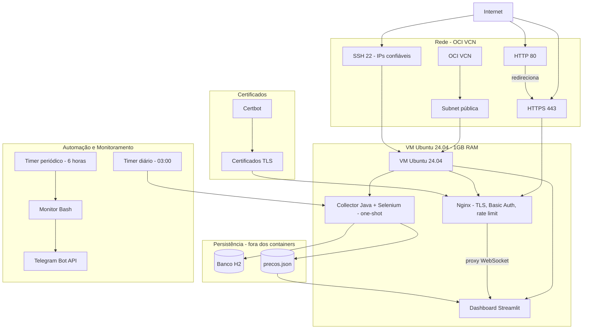

<div align="center">

# 💸 Price Monitor Oracle Infra

### Infraestrutura como código para executar um monitor de preços na Oracle Cloud

Provisionamento reproduzível com **Terraform**, bootstrap com **cloud-init**, execução em **Docker Compose**, proxy reverso **Nginx**, HTTPS automático, autenticação, coleta agendada e monitoramento via Telegram.

[](https://developer.hashicorp.com/terraform)
[](https://www.oracle.com/cloud/)
[](https://docs.docker.com/compose/)
[](https://nginx.org/)
[](https://openjdk.org/)
[](https://streamlit.io/)
[](#-estado-atual)

**Infraestrutura:** este repositório
**Aplicação:** [Sc4rlxrd/Dashboard-Java-e-Python](https://github.com/Sc4rlxrd/Dashboard-Java-e-Python)

</div>

---

## 📌 Visão geral

Este repositório provisiona uma VM Ubuntu na **Oracle Cloud Infrastructure** e instala toda a runtime necessária para executar um sistema pessoal de monitoramento de preços.

A solução foi desenhada para operar em uma VM pequena, com aproximadamente **1 GB de RAM**, mantendo continuamente apenas os componentes leves. O coletor Java, o Selenium e o Chromium são iniciados como um job agendado e encerrados ao fim de cada rodada.

Principais capacidades:

- infraestrutura OCI reproduzível com Terraform;
- configuração inicial automatizada com cloud-init;
- dashboard Python/Streamlit protegido por Nginx;
- coleta Java/Spring Boot com Selenium e Chromium;
- persistência em H2 e exportação de histórico para JSON;
- imagens Docker publicadas no GHCR para AMD64 e ARM64;
- HTTPS emitido para o IP público com renovação automática;
- Basic Auth com suporte a múltiplos usuários;
- rate limiting, limite de conexões e headers de segurança;
- timers do systemd para coleta e monitoramento;
- alertas periódicos da VM enviados ao Telegram;
- SSH restrito a endereços IPv4 confiáveis;
- recriação completa da infraestrutura testada com `destroy` e `apply`.

> Este é um laboratório pessoal de DevOps e infraestrutura. Não é uma arquitetura de alta disponibilidade nem um serviço comercial.

---

## ✅ Estado atual

| Componente | Estado |
|---|---|
| Infraestrutura OCI | Provisionada pelo Terraform |
| VM Ubuntu | Ativa |
| Dashboard Streamlit | Ativo e saudável |
| Nginx | Ativo nas portas 80 e 443 |
| HTTPS/TLS | Ativo com renovação pelo Certbot |
| Basic Auth | Ativo |
| Rate limiting | Ativo |
| Collector Java | Executado como job one-shot |
| Persistência H2 | Ativa |
| Exportação JSON | Ativa |
| Timer do collector | Ativo, execução diária às 03:00 |
| Monitoramento Telegram | Ativo, execução periódica a cada 6 horas |
| Recriação do zero | Validada com Terraform + cloud-init |

---

## 🧭 Arquitetura



### Fluxo de acesso

```text
Cliente
   │
   ├── HTTP :80  ──► redirecionamento para HTTPS
   │
   └── HTTPS :443
          │
          ▼
        Nginx
          │
          ├── TLS
          ├── Basic Auth
          ├── rate limit
          ├── headers de segurança
          └── proxy WebSocket
                  │
                  ▼
          Dashboard Streamlit :8501
```

O Streamlit não publica a porta `8501` diretamente no host. Apenas o Nginx recebe tráfego externo.

### Fluxo da coleta

```text
price-monitor-collector.timer
              │
              ▼
price-monitor-collector.service
              │
              ▼
run-price-collector.sh
              │
              ├── adquire lock de execução
              ├── para Nginx e dashboard para liberar memória
              ├── executa o collector como container one-shot
              ├── atualiza o banco H2
              ├── exporta o histórico para precos.json
              ├── valida os arquivos persistidos
              └── restaura dashboard e Nginx
```

Falhas individuais de scraping não interrompem necessariamente a rodada inteira. O coletor continua processando as URLs restantes e informa ao final a quantidade de sucessos e falhas.

---

## ☁️ Infraestrutura provisionada

O Terraform cria e gerencia:

- VCN;
- subnet pública;
- Internet Gateway;
- Route Table;
- Security List;
- instância Compute;
- VNIC;
- IP público;
- boot volume;
- chave pública SSH;
- metadata com cloud-init;
- tags do projeto.

### Perfil atual da VM

| Item | Configuração |
|---|---|
| Shape | `VM.Standard.E2.1.Micro` |
| Arquitetura | x86-64 / AMD64 |
| Sistema operacional | Ubuntu 24.04 LTS |
| vCPUs apresentadas | 2 |
| Memória | aproximadamente 1 GB |
| Swap | 2 GB |
| Boot volume | 50 GB |
| Timezone | `America/Sao_Paulo` |
| Rede | subnet pública OCI |

O projeto também mantém suporte a shapes Flex. Quando `instance_shape` termina com `.Flex`, o Terraform aplica `instance_ocpus` e `instance_memory_in_gbs`.

> Confirme no Console da OCI se a shape, o boot volume e os demais recursos utilizados permanecem dentro dos limites gratuitos ou contratados da conta.

---

## 📦 Stack de aplicação

### Containers

| Serviço | Imagem | Responsabilidade | Execução |
|---|---|---|---|
| `nginx` | `nginx:stable-alpine` | TLS, autenticação e proxy reverso | Contínua |
| `dashboard` | `ghcr.io/sc4rlxrd/price-monitor-dashboard` | Interface Streamlit | Contínua |
| `collector` | `ghcr.io/sc4rlxrd/price-monitor-collector` | Scraping e persistência | One-shot |

As imagens da aplicação são publicadas com tags baseadas em commit e possuem suporte a:

- `linux/amd64`;
- `linux/arm64`.

### Limites de memória

| Serviço | Limite |
|---|---:|
| Nginx | `64m` |
| Dashboard | `320m` |
| Collector | `768m` |

O collector recebe limites adicionais para a JVM:

```text
-Xms64m
-Xmx192m
-Duser.timezone=America/Sao_Paulo
-XX:+ExitOnOutOfMemoryError
```

### Redes Docker

| Rede | Participantes | Finalidade |
|---|---|---|
| `frontend` | Nginx e dashboard | Comunicação do proxy com o Streamlit |
| `egress` | Collector | Acesso de saída para as lojas monitoradas |

O collector não participa da rede do frontend e não publica portas.

---

## 💾 Persistência

Os dados são armazenados no host, fora do ciclo de vida dos containers:

```text
/opt/price-monitor/data/
├── price-monitor.mv.db
└── precos.json
```

| Arquivo | Responsabilidade |
|---|---|
| `price-monitor.mv.db` | Banco H2 persistido em arquivo |
| `precos.json` | Histórico exportado para o dashboard |

Outros arquivos importantes:

```text
/opt/price-monitor/
├── compose.yaml
├── config/
│   └── urls.txt
├── certbot/
│   └── www/
├── data/
└── nginx/
    ├── active.conf
    ├── auth/
    │   └── .htpasswd
    ├── bootstrap.conf
    └── default.conf.tftpl
```

Como `preserve_boot_volume = false`, destruir a VM também pode eliminar esses dados. Faça backup antes de qualquer destruição.

---

## 📂 Estrutura do repositório

```text
.
├── cloud-init/
│   ├── k3s.yaml.tftpl
│   └── price-monitor.yaml.tftpl
├── config/
│   └── urls.txt
├── docker/
│   ├── nginx/
│   │   ├── bootstrap.conf.tftpl
│   │   └── default.conf.tftpl
│   └── price-monitor-compose.yaml
├── monitoring/
│   ├── telegram.env.example
│   ├── vm-monitor-telegram.service
│   ├── vm-monitor-telegram.sh
│   └── vm-monitor-telegram.timer
├── scripts/
│   ├── bootstrap-price-monitor.sh
│   ├── configure-https.sh
│   ├── reload-price-monitor-nginx.sh
│   └── run-price-collector.sh
├── systemd/
│   ├── price-monitor-collector.service
│   └── price-monitor-collector.timer
├── compute.tf
├── data.tf
├── locals.tf
├── network.tf
├── outputs.tf
├── providers.tf
├── security.tf
├── terraform.tfvars.example
├── variables.tf
├── versions.tf
├── .gitignore
├── .terraform.lock.hcl
└── README.md
```

### Responsabilidades

| Arquivo ou diretório | Responsabilidade |
|---|---|
| `versions.tf` | Versões do Terraform e do provider OCI |
| `providers.tf` | Configuração do provider OCI |
| `variables.tf` | Variáveis e validações |
| `locals.tf` | Prefixos e tags compartilhadas |
| `data.tf` | Imagens, Availability Domains e Fault Domains |
| `network.tf` | VCN, subnet, gateway e rotas |
| `security.tf` | Regras de entrada e saída |
| `compute.tf` | VM, metadata e montagem do cloud-init |
| `outputs.tf` | IPs, OCIDs e informações da instância |
| `cloud-init/price-monitor.yaml.tftpl` | Instala os arquivos e executa o bootstrap |
| `docker/price-monitor-compose.yaml` | Runtime de produção |
| `docker/nginx/` | Configuração HTTP temporária e HTTPS definitiva |
| `scripts/bootstrap-price-monitor.sh` | Instala Docker, cria swap e inicia a aplicação |
| `scripts/configure-https.sh` | Emite o certificado e ativa a configuração TLS |
| `scripts/run-price-collector.sh` | Coordena a coleta e restaura a aplicação |
| `systemd/` | Agendamento diário do collector |
| `monitoring/` | Monitoramento da VM e integração com Telegram |
| `config/urls.txt` | Produtos monitorados, sem rebuild de imagem |
| `cloud-init/k3s.yaml.tftpl` | Referência histórica para estudos com K3s |

---

## ✅ Pré-requisitos

| Requisito | Observação |
|---|---|
| Conta Oracle Cloud | Com permissão para criar os recursos utilizados |
| Terraform | `>= 1.8.0, < 2.0.0` |
| Provider OCI | Versão definida em `versions.tf` |
| Perfil OCI local | Chave de API e configuração válidas |
| Chave SSH | Par de chaves para acesso à VM |
| Git | Para clonar e versionar o projeto |
| IPv4 público atual | Necessário para restringir a porta 22 |

Para descobrir seu IPv4 público:

```bash
curl -4 https://api.ipify.org
echo
```

---

## ⚙️ Configuração

Crie o arquivo local a partir do exemplo:

```bash
cp terraform.tfvars.example terraform.tfvars
```

Exemplo:

```hcl
region           = "sa-saopaulo-1"
compartment_ocid = "ocid1.compartment.oc1..<COMPARTMENT_OCID>"

project_name = "price-monitor"
environment  = "prod"

vcn_cidr_block           = "10.0.0.0/16"
public_subnet_cidr_block = "10.0.1.0/24"

ssh_allowed_cidrs = [
  "<IP_PUBLICO_PRINCIPAL>/32",
  "<IP_PUBLICO_ALTERNATIVO>/32",
]

web_allowed_cidr = "0.0.0.0/0"

instance_shape          = "VM.Standard.E2.1.Micro"
boot_volume_size_in_gbs = 50

ssh_public_key_path = "/home/USUARIO/.ssh/price_monitor_oracle.pub"

letsencrypt_email   = "admin@example.com"
letsencrypt_staging = true

dashboard_auth_username = "ADMIN"
```

### Variáveis

| Variável | Descrição |
|---|---|
| `region` | Região da OCI |
| `compartment_ocid` | OCID do compartment |
| `project_name` | Prefixo usado nos recursos |
| `environment` | `dev`, `staging` ou `prod` |
| `vcn_cidr_block` | CIDR da VCN |
| `public_subnet_cidr_block` | CIDR da subnet pública |
| `ssh_allowed_cidrs` | Redes autorizadas a acessar SSH |
| `web_allowed_cidr` | Rede autorizada a acessar HTTP/HTTPS |
| `instance_shape` | Shape da VM |
| `instance_ocpus` | OCPUs para shapes Flex |
| `instance_memory_in_gbs` | Memória para shapes Flex |
| `boot_volume_size_in_gbs` | Tamanho do boot volume |
| `ssh_public_key_path` | Caminho da chave SSH pública |
| `fault_domain_index` | Índice do Fault Domain |
| `letsencrypt_email` | E-mail da conta Let's Encrypt |
| `letsencrypt_staging` | Usa o ambiente de testes do Let's Encrypt |
| `dashboard_auth_username` | Usuário inicial do Basic Auth |

As variáveis de CPU e memória são ignoradas para shapes fixas que não terminam com `.Flex`.

---

## 🚀 Provisionamento

### 1. Inicializar e validar

```bash
terraform init
terraform fmt -recursive
terraform validate
```

### 2. Criar e revisar um plano salvo

```bash
terraform plan \
  -out=price-monitor.tfplan

terraform show \
  price-monitor.tfplan
```

O plano inicial deve mostrar apenas recursos a criar:

```text
Plan: N to add, 0 to change, 0 to destroy.
```

### 3. Aplicar

```bash
terraform apply \
  price-monitor.tfplan
```

### 4. Obter o IP público

```bash
terraform output \
  -raw instance_public_ip
```

Também é possível salvar o valor em uma variável de shell:

```bash
VM_IP="$(terraform output -raw instance_public_ip)"
echo "${VM_IP}"
```

### 5. Aguardar o cloud-init

```bash
ssh "ubuntu@${VM_IP}" \
  'sudo cloud-init status --wait'
```

Acompanhar o bootstrap:

```bash
ssh "ubuntu@${VM_IP}" \
  'sudo tail -f /var/log/cloud-init-output.log'
```

Resultado esperado:

```text
status: done
```

---

## 🔑 Acesso ao dashboard

Abra:

```text
https://<IP_PUBLICO>
```

O Nginx exige Basic Auth.

As credenciais iniciais são criadas dentro da VM, evitando que a senha seja armazenada no Terraform State:

```bash
ssh "ubuntu@${VM_IP}" \
  'sudo cat /root/price-monitor-initial-password.txt'
```

Depois de salvar a credencial em um gerenciador de senhas:

```bash
ssh "ubuntu@${VM_IP}" \
  'sudo rm /root/price-monitor-initial-password.txt'
```

### Alterar a senha

```bash
sudo htpasswd \
  -B \
  /opt/price-monitor/nginx/auth/.htpasswd \
  ADMIN
```

### Adicionar outro usuário

```bash
sudo htpasswd \
  -B \
  /opt/price-monitor/nginx/auth/.htpasswd \
  OUTRO_USUARIO
```

Não use `-c` ao adicionar um usuário, pois essa opção recria o arquivo.

### Listar usuários

```bash
sudo cut \
  -d: \
  -f1 \
  /opt/price-monitor/nginx/auth/.htpasswd
```

### Remover um usuário

```bash
sudo htpasswd \
  -D \
  /opt/price-monitor/nginx/auth/.htpasswd \
  OUTRO_USUARIO
```

Os usuários do Basic Auth possuem o mesmo nível de acesso. O mecanismo atual não implementa papéis diferentes.

---

## 🔐 HTTPS e Nginx

O bootstrap executa duas etapas:

1. sobe o Nginx com uma configuração HTTP temporária;
2. emite o certificado, renderiza a configuração final e recarrega o Nginx.

### Configuração implementada

- redirecionamento HTTP para HTTPS;
- certificado para o IPv4 público;
- TLS 1.2 e TLS 1.3;
- renovação automática pelo Certbot;
- deploy hook para validar e recarregar o Nginx;
- suporte a WebSocket do Streamlit;
- Basic Auth;
- rate limiting;
- limite de conexões por IP;
- bloqueio de arquivos ocultos e extensões de backup;
- headers de segurança;
- ocultação de informações desnecessárias do proxy.

Verificar o timer do Certbot:

```bash
systemctl list-timers \
  snap.certbot.renew.timer \
  --all
```

Testar o endpoint sem credenciais:

```bash
curl \
  --head \
  "https://${VM_IP}"
```

Resposta esperada:

```text
HTTP/1.1 401 Unauthorized
WWW-Authenticate: Basic realm="Price Monitor"
```

---

## 🤖 Monitoramento via Telegram

O monitor envia:

- hostname;
- IP público;
- CPU;
- RAM;
- swap;
- disco;
- load average;
- uptime;
- data e horário.

O timer executa dois minutos após o boot e, depois, aproximadamente a cada seis horas.

### Arquivo de segredo

Crie localmente:

```bash
cp \
  monitoring/telegram.env.example \
  monitoring/telegram.env
```

Formato:

```dotenv
TELEGRAM_BOT_TOKEN=<TOKEN>
TELEGRAM_CHAT_ID=<CHAT_ID>
```

O arquivo real não deve ser versionado nem enviado pelo Terraform, evitando que o token seja armazenado no state.

### Enviar o segredo para a VM

```bash
VM_IP="$(terraform output -raw instance_public_ip)"

scp \
  monitoring/telegram.env \
  "ubuntu@${VM_IP}:/tmp/telegram.env"
```

```bash
ssh "ubuntu@${VM_IP}" '
  sudo install \
    --directory \
    --owner root \
    --group root \
    --mode 0755 \
    /etc/vm-monitor

  sudo install \
    --owner root \
    --group root \
    --mode 0600 \
    /tmp/telegram.env \
    /etc/vm-monitor/telegram.env

  rm -f /tmp/telegram.env

  sudo systemctl daemon-reload
  sudo systemctl enable --now vm-monitor-telegram.timer
  sudo systemctl start vm-monitor-telegram.service
'
```

### Verificar

```bash
systemctl status \
  vm-monitor-telegram.timer \
  --no-pager

systemctl list-timers \
  vm-monitor-telegram.timer \
  --all

sudo journalctl \
  -u vm-monitor-telegram.service \
  -n 50 \
  --no-pager
```

---

## ⏱️ Collector agendado

O collector é executado automaticamente **quatro vezes por dia**, com intervalo de aproximadamente seis horas, nos seguintes horários, utilizando o timezone `America/Sao_Paulo`.

```text
05:00
11:00
17:00
23:00
```

### Verificar o timer

```bash
systemctl status \
  price-monitor-collector.timer \
  --no-pager

systemctl list-timers \
  price-monitor-collector.timer \
  --all
```

O estado esperado é:

```text
Loaded: loaded
Active: active (waiting)
```

### Executar manualmente

```bash
sudo systemctl start \
  --no-block \
  price-monitor-collector.service
```

Acompanhar:

```bash
sudo journalctl \
  -u price-monitor-collector.service \
  -f
```

O container do collector não permanece visível após a execução porque o job utiliza:

```text
docker compose run --rm
```

### Conferir o resultado

```bash
sudo ls -lh \
  /opt/price-monitor/data
```

```bash
sudo python3 - <<'PY'
import json
from pathlib import Path

path = Path("/opt/price-monitor/data/precos.json")
history = json.loads(path.read_text(encoding="utf-8"))

print(f"Registros exportados: {len(history)}")
PY
```

---

## 🛠️ Operação da aplicação

Na VM:

```bash
cd /opt/price-monitor
```

### Containers

```bash
sudo docker compose ps
sudo docker compose ps -a
sudo docker stats
```

### Logs

```bash
sudo docker compose logs \
  --tail=100

sudo docker compose logs \
  --tail=100 \
  dashboard

sudo docker compose logs \
  --tail=100 \
  nginx
```

### Ciclo de vida

```bash
sudo docker compose restart

sudo docker compose down

sudo docker compose up \
  --detach \
  dashboard \
  nginx
```

### Validar a configuração

```bash
sudo docker compose \
  --profile collector \
  config \
  --quiet
```

### Validar o Nginx

```bash
sudo docker exec \
  price-monitor-nginx \
  nginx -t
```

---

## 🔎 Comandos de diagnóstico

### Cloud-init

```bash
sudo cloud-init status --long

sudo journalctl \
  -u cloud-final.service \
  -n 200 \
  --no-pager

sudo tail \
  -n 250 \
  /var/log/cloud-init-output.log
```

### Systemd

```bash
systemctl list-timers \
  --all |
grep -E 'price-monitor|vm-monitor|certbot'
```

```bash
sudo journalctl \
  -u price-monitor-collector.service \
  -n 300 \
  --no-pager
```

```bash
sudo journalctl \
  -u vm-monitor-telegram.service \
  -n 100 \
  --no-pager
```

### Sistema

```bash
hostnamectl
free -h
swapon --show
df -h
uname -a
lscpu
```

### Teste do HTTPS

```bash
curl \
  --head \
  "https://${VM_IP}"
```

### Teste do dashboard com usuário

```bash
curl \
  --head \
  --user ADMIN \
  "https://${VM_IP}"
```

O `curl` solicitará a senha sem expô-la no histórico do shell.

---

## 🔒 Segurança

### Rede

- porta 22 restrita aos CIDRs configurados;
- portas 80 e 443 controladas por `web_allowed_cidr`;
- dashboard sem porta pública própria;
- collector sem portas publicadas;
- apenas o Nginx recebe tráfego web externo.

### Credenciais

Nunca versione:

- `terraform.tfvars`;
- `terraform.tfstate`;
- `terraform.tfstate.backup`;
- arquivos `*.tfplan`;
- chaves privadas da OCI;
- chaves privadas SSH;
- `monitoring/telegram.env`;
- tokens e senhas;
- arquivos `.env` reais;
- certificados privados.

### Systemd

O serviço do Telegram utiliza controles como:

- usuário sem privilégios;
- `NoNewPrivileges`;
- filesystem protegido;
- proteção de kernel, módulos, control groups e relógio;
- capability bounding set vazio;
- famílias de endereço restritas.

### User data

A instância ignora mudanças posteriores em `metadata["user_data"]`:

```hcl
lifecycle {
  ignore_changes = [
    metadata["user_data"]
  ]
}
```

Consequências:

- alterações locais no cloud-init não são reaplicadas em uma VM existente;
- novas VMs recebem a versão atualizada;
- mudanças no bootstrap não substituem acidentalmente a instância;
- atualizações em uma VM já criada devem ser aplicadas manualmente ou por um processo de deploy.

Sempre revise o plano procurando:

```text
must be replaced
```

---

## 💾 Backup e restauração

Antes de destruir a infraestrutura, salve:

```text
/opt/price-monitor/data/price-monitor.mv.db
/opt/price-monitor/data/precos.json
/opt/price-monitor/config/urls.txt
/opt/price-monitor/nginx/auth/.htpasswd
/etc/vm-monitor/telegram.env
```

Exemplo de backup para a máquina local:

```bash
VM_IP="$(terraform output -raw instance_public_ip)"

mkdir -p \
  backups/price-monitor

scp \
  "ubuntu@${VM_IP}:/opt/price-monitor/data/precos.json" \
  backups/price-monitor/
```

Arquivos protegidos por root devem ser copiados primeiro para uma área temporária segura ou empacotados com `sudo`.

Também faça backup do state:

```bash
mkdir -p \
  "$HOME/.local/share/terraform-state-backups/price-monitor"

terraform state pull > \
  "$HOME/.local/share/terraform-state-backups/price-monitor/state-$(date +%Y%m%d-%H%M%S).tfstate"
```

---

## 💥 Destruição controlada

Crie e revise um plano de destruição:

```bash
terraform plan \
  -destroy \
  -out=destroy-price-monitor.tfplan

terraform show \
  destroy-price-monitor.tfplan
```

O resumo deve conter somente destruições:

```text
Plan: 0 to add, 0 to change, N to destroy.
```

Aplicar:

```bash
terraform apply \
  destroy-price-monitor.tfplan
```

> O boot volume não é preservado. Dados não copiados podem ser perdidos permanentemente.

---

## 🧪 Validação completa após o deploy

```bash
VM_IP="$(terraform output -raw instance_public_ip)"
```

```bash
ssh "ubuntu@${VM_IP}" '
  set -e

  sudo cloud-init status --long

  cd /opt/price-monitor
  sudo docker compose ps

  systemctl is-enabled price-monitor-collector.timer
  systemctl is-active price-monitor-collector.timer

  systemctl is-enabled vm-monitor-telegram.timer
  systemctl is-active vm-monitor-telegram.timer

  sudo docker exec price-monitor-nginx nginx -t
'
```

Resultado esperado:

- cloud-init concluído;
- dashboard saudável;
- Nginx ativo;
- timers habilitados e ativos;
- configuração do Nginx válida.

---


## 📜 Histórico

O projeto passou por três fases:

1. **BookCommerce**
   O repositório nasceu como estudo de infraestrutura para uma aplicação de microsserviços com K3s e Helm.

2. **WordPress pessoal**
   Diante da indisponibilidade da shape ARM desejada, a VM foi utilizada como laboratório de Docker, Nginx, HTTPS, Terraform e administração Linux.

3. **Price Monitor**
   O WordPress e o MariaDB foram removidos. A infraestrutura passou a hospedar um projeto real do autor, com dashboard Streamlit, collector Java/Selenium, H2, GHCR, Nginx, HTTPS, Basic Auth, systemd e Telegram.

Alguns nomes internos herdados, como labels Terraform ou hostname, podem permanecer temporariamente por razões históricas. Eles não representam a aplicação executada atualmente.

---

## 📏 Boas práticas adotadas

- planos Terraform salvos e revisados antes do `apply`;
- state e variáveis reais fora do Git;
- senha do dashboard gerada dentro da VM;
- token do Telegram enviado fora do Terraform;
- SSH restrito a redes confiáveis;
- imagens da aplicação identificadas por SHA;
- collector isolado e executado somente quando necessário;
- persistência fora dos containers;
- logs centralizados no journal e no Docker;
- Nginx como única entrada pública da aplicação;
- limites de memória ajustados para uma VM pequena;
- infraestrutura e aplicação mantidas em repositórios separados.

---

## 👤 Autor

Desenvolvido por **[@Sc4rlxrd](https://github.com/Sc4rlxrd)**.

Projeto pessoal de estudos em:

`Terraform` · `Oracle Cloud` · `Linux` · `cloud-init` · `Docker` · `Nginx` · `HTTPS/TLS` · `systemd` · `Java` · `Spring Boot` · `Selenium` · `Python` · `Streamlit` · `H2` · `Telegram` · `Infraestrutura como Código`

---

<div align="center">

**Infraestrutura reproduzível para um projeto real, construída como laboratório de DevOps.**

</div>